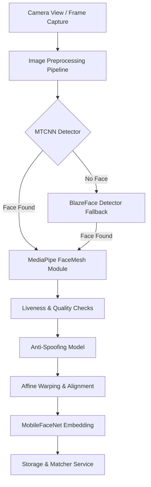

# FaceGate Codebase Map & Architecture

This document serves as a "mini-map" of the codebase for the **FaceGate** (NHAI) React Native Expo application. When prompting an AI, referencing this map helps target specific files and components without scanning the entire workspace.

---

## 🗺️ High-Level Architecture Overview

FaceGate is an offline-first, on-device biometric authentication app that uses customized TensorFlow Lite / TensorFlow.js pipelines.



---

## 📂 Directory Structure Map

Below is the directory map with brief file descriptions to help target imports and edits.

### 📱 `app/` (Expo Router File-Based Navigation)

Contains the screens and routing layout.
*   [`app/_layout.tsx`](file:///c:/Users/akith/OneDrive/Desktop/nhai/app/_layout.tsx): Root navigation wrapper. Configures paper provider, navigation themes, and loads custom fonts.
*   [`app/index.tsx`](file:///c:/Users/akith/OneDrive/Desktop/nhai/app/index.tsx): Initial redirect logic. Routes to `/(tabs)` if already logged in, otherwise redirects to `/login`.
*   [`app/splash.tsx`](file:///c:/Users/akith/OneDrive/Desktop/nhai/app/splash.tsx): Premium animated entry portal that pre-loads TensorFlow models with progress tracking.
*   [`app/login.tsx`](file:///c:/Users/akith/OneDrive/Desktop/nhai/app/login.tsx): User authentication portal. Uses the camera and real-time matcher. Features an Admin Bypass button in the top-right corner to allow instant entry to the tabs console.
*   [`app/register.tsx`](file:///c:/Users/akith/OneDrive/Desktop/nhai/app/register.tsx): Admin registration page where users can input registration details and capture face profile bursts.
*   [`app/register-portal.tsx`](file:///c:/Users/akith/OneDrive/Desktop/nhai/app/register-portal.tsx): Web-alternative/admin panel interface for self-registration.
*   [`app/authenticate.tsx`](file:///c:/Users/akith/OneDrive/Desktop/nhai/app/authenticate.tsx): Dedicated general verification screen.
*   [`app/(tabs)/`](file:///c:/Users/akith/OneDrive/Desktop/nhai/app/(tabs)/): Subdirectory hosting the tab-bar screens.
    *   [`app/(tabs)/_layout.tsx`](file:///c:/Users/akith/OneDrive/Desktop/nhai/app/(tabs)/_layout.tsx): Tabs layout wrapper. Renders the tab bar navigation, including a central decorative, non-interactive shield icon.
    *   [`app/(tabs)/index.tsx`](file:///c:/Users/akith/OneDrive/Desktop/nhai/app/(tabs)/index.tsx): Main dashboard view. Shows stats, recent logs, and features.
    *   [`app/(tabs)/users.tsx`](file:///c:/Users/akith/OneDrive/Desktop/nhai/app/(tabs)/users.tsx): Database administration screen showing enrolled users.
    *   [`app/(tabs)/sync.tsx`](file:///c:/Users/akith/OneDrive/Desktop/nhai/app/(tabs)/sync.tsx): Server sync configurations (AWS endpoints).
    *   [`app/(tabs)/settings.tsx`](file:///c:/Users/akith/OneDrive/Desktop/nhai/app/(tabs)/settings.tsx): Custom settings (threshold calibration, liveness options, diagnostic tools).

### ⚙️ `src/engine/` (On-Device AI/ML Engine)

The processing core which handles all real-time video frame manipulation and classification.
*   [`src/engine/frameProcessor.ts`](file:///c:/Users/akith/OneDrive/Desktop/nhai/src/engine/frameProcessor.ts): Core native processing logic orchestrating image enhancement, face detection, face-mesh extraction, liveness testing, alignment, and final matching.
*   [`src/engine/frameProcessor.web.ts`](file:///c:/Users/akith/OneDrive/Desktop/nhai/src/engine/frameProcessor.web.ts): Web browser alternative frame processor.
*   [`src/engine/faceMeshModule.ts`](file:///c:/Users/akith/OneDrive/Desktop/nhai/src/engine/faceMeshModule.ts): Landmark processing module. Reconstructs landmarks, computes face angle/size, monitors blink detection (EAR), checks smile status, and performs sub-pixel bilinear affine warp to straighten the face.
*   [`src/engine/alignment.ts`](file:///c:/Users/akith/OneDrive/Desktop/nhai/src/engine/alignment.ts): Utilities to isolate landmark points and normalize raw 112x112 face buffers.
*   [`src/engine/imagePreprocessing.ts`](file:///c:/Users/akith/OneDrive/Desktop/nhai/src/engine/imagePreprocessing.ts): Preprocessing operations (Gray World white-balance, CLAHE adaptive histogram equalization, lighting scores, and custom LUT-based contrast enhancement).
*   [`src/engine/livenessChecker.ts`](file:///c:/Users/akith/OneDrive/Desktop/nhai/src/engine/livenessChecker.ts): Manages state and verification criteria for multi-step active liveness challenges.
*   [`src/engine/matcher.ts`](file:///c:/Users/akith/OneDrive/Desktop/nhai/src/engine/matcher.ts): Optimized Euclidean distance calculations. Implements early-exit optimizations and a piecewise confidence scoring algorithm mapping target ratios to clean percentages.
*   [`src/engine/modelLoader.ts`](file:///c:/Users/akith/OneDrive/Desktop/nhai/src/engine/modelLoader.ts): Controls loading sequence and lifetime hooks for TFLite models.
*   [`src/engine/embeddingValidator.ts`](file:///c:/Users/akith/OneDrive/Desktop/nhai/src/engine/embeddingValidator.ts): Ensures captured biometric descriptors match strict quality parameters before database entry.
*   [`src/engine/mtcnnModule.ts`](file:///c:/Users/akith/OneDrive/Desktop/nhai/src/engine/mtcnnModule.ts): Multi-task Cascaded Convolutional Networks (MTCNN) implementation (P-Net, R-Net, O-Net) for high-precision face detection.
*   [`src/engine/antiSpoofingModule.ts`](file:///c:/Users/akith/OneDrive/Desktop/nhai/src/engine/antiSpoofingModule.ts): Passive anti-spoofing liveness model that checks the face crop for presentation attacks (photos, masks, or replay attacks).

### 🧪 `services/` (Services & Storage)

*   [`services/storageService.ts`](file:///c:/Users/akith/OneDrive/Desktop/nhai/services/storageService.ts): Unified Storage abstraction. Redirects all database operations (users, embeddings, attendance, logs) to `sqliteService` on Native platforms (Android/iOS), while using `localStorage` (via `localStore`) as a fallback on Web. Manages global settings, session state, AWS cloud endpoints, and connection probing.
*   [`services/i18n.ts`](file:///c:/Users/akith/OneDrive/Desktop/nhai/services/i18n.ts): Central translation dictionary and helper utility. Supports 10 Indian regional languages (English, Hindi, Marathi, Tamil, Telugu, Kannada, Bengali, Gujarati, Malayalam, and Punjabi) and registers dynamic reactive listeners for locale updates.
*   [`services/sqliteService.ts`](file:///c:/Users/akith/OneDrive/Desktop/nhai/services/sqliteService.ts): The primary local database engine on Native. Manages table creation, migration, seeding, and full CRUD query execution for:
    *   `users`: User profile registry.
    *   `embeddings`: Supports multi-embedding registration storage (1 base + up to 8 extra vectors).
    *   `attendance`: Attendance records tagged with `pending` / `synced` flags for offline-first capabilities.
    *   `logs`: Dashboard history logs.
    *   `auth_logs`: Detailed telemetry security logs.
*   [`services/faceApiService.ts`](file:///c:/Users/akith/OneDrive/Desktop/nhai/services/faceApiService.ts): REST wrapper for optional remote verification backend syncs.

### 🎨 `components/` (Modular UI Components)

*   `camera/`: Camera overlays.
    *   [`components/camera/CameraView.tsx`](file:///c:/Users/akith/OneDrive/Desktop/nhai/components/camera/CameraView.tsx): VisionCamera wrapper with native frame hooks.
    *   [`components/camera/CameraView.web.tsx`](file:///c:/Users/akith/OneDrive/Desktop/nhai/components/camera/CameraView.web.tsx): HTML5 video webcam fallback.
    *   [`components/camera/FaceOvalGuide.tsx`](file:///c:/Users/akith/OneDrive/Desktop/nhai/components/camera/FaceOvalGuide.tsx): SVG face positioning guide with micro-animation prompts.
    *   [`components/camera/ScanRing.tsx`](file:///c:/Users/akith/OneDrive/Desktop/nhai/components/camera/ScanRing.tsx): High-fidelity circular scanner showing real-time analysis status.
    *   [`components/camera/LightingIndicator.tsx`](file:///c:/Users/akith/OneDrive/Desktop/nhai/components/camera/LightingIndicator.tsx): Dashboard warning of low light, glare, or heavy shadows.
    *   [`components/camera/ConfidenceRing.tsx`](file:///c:/Users/akith/OneDrive/Desktop/nhai/components/camera/ConfidenceRing.tsx): Circular tracker displaying Match Confidence.
    *   [`components/camera/LivenessPrompt.tsx`](file:///c:/Users/akith/OneDrive/Desktop/nhai/components/camera/LivenessPrompt.tsx): Visual cues guiding the user through active challenges (e.g. smile, blink).
*   `ui/`: Modular interactive building blocks.
    *   [`components/ui/AnimatedButton.tsx`](file:///c:/Users/akith/OneDrive/Desktop/nhai/components/ui/AnimatedButton.tsx): Haptic-responsive button with reanimated spring feedback.
    *   [`components/ui/ConfirmDialog.tsx`](file:///c:/Users/akith/OneDrive/Desktop/nhai/components/ui/ConfirmDialog.tsx): Customizable popup panel.
    *   [`components/ui/GlassCard.tsx`](file:///c:/Users/akith/OneDrive/Desktop/nhai/components/ui/GlassCard.tsx): Translucent layout container.
    *   [`components/ui/NetworkIndicator.tsx`](file:///c:/Users/akith/OneDrive/Desktop/nhai/components/ui/NetworkIndicator.tsx): Visual status of backend server availability.
*   screens/ & skeletons/: Fallbacks.
    *   [`components/screens/OfflineBanner.tsx`](file:///c:/Users/akith/OneDrive/Desktop/nhai/components/screens/OfflineBanner.tsx): Global connection banner that polls network status on Native and listens to browser connectivity on Web. Transitioning online triggers auto-sync, and registers for success notifications to display a premium green `'synced'` banner.
    *   [`components/screens/CameraPermission.tsx`](file:///c:/Users/akith/OneDrive/Desktop/nhai/components/screens/CameraPermission.tsx): Permission request screen.
    *   [`components/screens/ModelLoadError.tsx`](file:///c:/Users/akith/OneDrive/Desktop/nhai/components/screens/ModelLoadError.tsx): Recovery flow if models fail to load.
    *   [`components/skeletons/HomeSkeleton.tsx`](file:///c:/Users/akith/OneDrive/Desktop/nhai/components/skeletons/HomeSkeleton.tsx): Dashboard loading state placeholder.

---

## 🔄 App Flows Reference

### 🔐 1. Authentication Flow

```
[Camera frame captured]
        │
        ▼
[Image Enhancement] (White Balance, Adaptive LUT Contrast)
        │
        ▼
[MTCNN Detection Run] ──(No face found)──> [BlazeFace Fallback Run] ──(No face found)──> [Status: Align Face]
        │
        ▼
[FaceMesh Run] (Locates 468 points)
        │
        ▼
[Quality Inspection] (Shadows, extreme angle, size) ──(Fails)──> [Feedback Message]
        │
        ▼
[Passive Anti-Spoofing Check] ──(Fails)──> [Status: Spoof Detected]
        │
        ▼
[Active Liveness Check] (Analyzes EAR for blink / turn) ──(No signal)──> [Prompt Action]
        │
        ▼
[Affine Warp] (Normalizes rotation and crops 112x112 image)
        │
        ▼
[MobileFaceNet Run] (Extracts 128D embedding vector)
        │
        ▼
[Matcher Check] (Calculates early-exit Euclidean distance against gallery)
        │
        ▼
[Result Returned] (Success / Failure logged, routes to dashboard on match)
```

### 📝 2. Registration Flow

1. Input details (Name, Indian phone number `+91XXXXXXXXXX`).
2. Run face capture; expects stable frontal alignment.
3. Performs stricter validation than login (e.g. angle tilt < 25°, open eyes, high score).
4. Saves a burst of embeddings: 1 base vector + up to 8 supplemental vectors stored in `storageService`.

---

## 💎 Premium UI/UX Animation & Theme System

FaceGate's visual presentation uses a high-fidelity biometric and cybertech design system built with custom CSS tokens, React Native SVG, and declarative animations via `react-native-reanimated`.

### 🎨 1. Theme Updates (`constants/theme.ts`)

*   **Dual-Accent Gradients**: Introduced a violet secondary accent (`#7C5CFC`) alongside the primary cyan (`#00D4FF`) to establish premium gradients across buttons, cards, and avatar rings.
*   **Glow & Ambient Tokens**: Added explicit dim and glow HSL variations to generate ambient backlighting, pulsing glows, and border reflections.

### 🌟 2. Shared Interactive Components (`components/ui/`)

*   **`GlassCard.tsx` (Top-edge Shimmer)**: Features a translating light reflection sweep along the card's top 1.5px border, mimicking physical glass catching light in a futuristic HUD.
*   **`AnimatedButton.tsx` (Sweep Shimmer)**: Initiates an angled 25% white sheen translation across the button surface upon mounting, drawing focus to CTAs.
*   **`StatusBadge.tsx` (Pulsing Live Dot)**: Replaces static status icons with a dual-element live indicator — a solid colored inner core surrounded by a matching outer ring that scales out to 1.8x and fades out continuously using spring loops.
*   **`ArchitectureIcons.tsx` (Regional Landmarks)**: Hand-drawn, highly optimized SVG vector paths representing 9 famous Indian monuments (Taj Mahal, Gateway of India, Brihadisvara Temple, Hampi Stone Chariot, Charminar, Howrah Bridge, Statue of Unity, Kerala Houseboat, Golden Temple) rendered side-by-side with localized language choices.

### 🛸 3. High-Fidelity Biometric Effects (`app/`)

*   **`FloatingParticle` System (`splash.tsx`, `login.tsx`)**: An ambient background system animating up to 10 lightweight circular nodes floating vertically with asynchronous delays and sine-wave opacities.
*   **`AnimatedFormIcon` (`login.tsx`)**: Wraps form illustrations, slowly spinning them 360° over 20 seconds while applying a spring-breathing pulse.
*   **`ScanningBeam` (`login.tsx`)**: A linear-gradient laser sweeping vertically between 10px and 340px over the camera container to indicate live biometric face processing.
*   **`RippleRing` Success Blast (`login.tsx`)**: Emits dual offset circular ripples expanding 2.2x and fading to 0% transparency behind the success checkmark when access is granted.
*   **Breathing Tab Shield (`app/(tabs)/_layout.tsx`)**: A central tab bar shield that continuously glows and pulses using repeating cosine ease functions, styled as a purely decorative, non-interactive icon.
*   **Regional Language Selection Screen**: A compact 2-column grid of options representing Indian states and their native languages. Selecting a region updates the layout translations dynamically across 10 locales and slides into the mobile input interface. Contains a top-right quick switcher globe icon.


