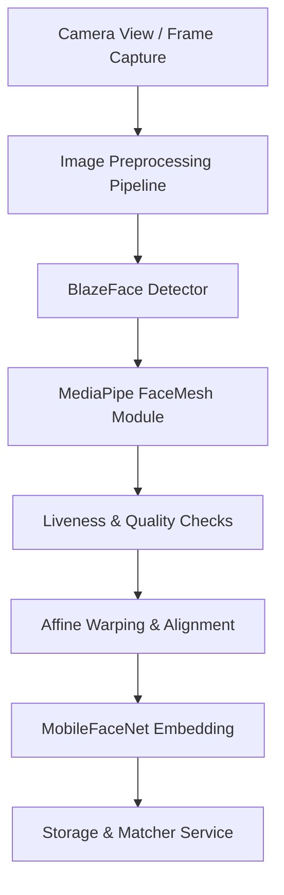

# 🛡️ FaceGate - Offline-First Biometric Authentication App

FaceGate is a premium, offline-first, on-device biometric authentication application designed for secure and fast identity verification. Developed using **React Native Expo**, it integrates custom **TensorFlow Lite (TFLite)** and **TensorFlow.js (WebGL)** pipelines to run all computer vision and deep learning tasks directly on the user's device.

This approach ensures zero network latency, absolute biometric privacy (since no face images or descriptors leave the device), and reliability in remote areas with poor connectivity.

---

## 🗺️ High-Level Architecture Overview

FaceGate's processing core operates on a sequential real-time pipeline that transforms raw camera frames into secure biometric embeddings:



---

## ✨ Key Features

- 🔋 **Offline-First AI Pipeline**: Runs completely on-device. No external cloud endpoints are required for authentication or enrollment.
- ⚡ **Multi-Stage AI Models**:
  - **BlazeFace**: Real-time bounding box detection optimized for mobile CPU/GPU.
  - **MediaPipe FaceMesh**: Tracks 468 3D landmarks for fine-grained alignment and gesture detection.
  - **MobileFaceNet (Int8 Quantized)**: Generates highly discriminative 128-dimensional embedding vectors for matching.
  - **Web TFLite Support**: Fully integrated pre-bundled web client using `tfjs-tflite` to run optimized custom TFLite models and handle dynamic batch sizes natively in the browser.
- 🧬 **Robust Active Liveness Challenge Engine**:
  - Monitors **Eye Aspect Ratio (EAR)** for blink detection.
  - Detects smiling and dynamic head rotations (left/right yaw, pitch) to block spoofing attacks (e.g., photos or video playback).
- ☀️ **Real-time Quality & Lighting Calibration**:
  - **Gray World** automatic white-balance correction.
  - **CLAHE** (Contrast Limited Adaptive Histogram Equalization) and custom LUT-based contrast enhancement.
  - Monitors shadow ratios, highlights, backlight conditions, and blur metrics to ensure high-fidelity embeddings.
- 🇮🇳 **Regional Language System**:
  - Fully translated and dynamically responsive to **10 Indian regional languages** (English, Hindi, Marathi, Tamil, Telugu, Kannada, Bengali, Gujarati, Malayalam, and Punjabi).
  - High-fidelity SVG vector landmarks representing famous historical Indian monuments based on language choice.
- 🔄 **Local-First Database & Cloud Sync**:
  - Leverages SQLite/AsyncStorage for local user registries and activity logs.
  - Secure integration hooks for optional remote background syncs to administrative AWS backend portals.

---

## 📂 Core Folder Structure

```
├── app/                  # Expo Router file-based screens and navigation layouts
│   ├── (tabs)/           # Dashboard, User Database, Sync, and Calibration Settings
│   ├── splash.tsx        # Animated loading portal pre-loading TFLite models
│   ├── login.tsx         # Real-time face authentication scanner
│   ├── register.tsx      # Admin-based user profile & burst vector enrollment
│   └── _layout.tsx       # Navigation wrapper, UI theme providers, and custom fonts
├── assets/               # Image resources, fonts, and .tflite model structures
├── components/           # Reusable UI component blocks
│   ├── camera/           # Camera views, oval alignment guides, scanning laser beam overlays
│   └── ui/               # Haptic buttons, Glassmorphic cards, custom status badges
├── services/             # Storage configuration, SQLite managers, and translation locales
└── src/                  # Biometric processing core
    ├── engine/           # Detection, alignment, quality checking, liveness, and matching engines
    └── types/            # TypeScript schemas for detection boxes, landmarks, and signals
```

---

## ⚡ Performance Benchmarks

The app uses heavily optimized model architectures to achieve low-latency performance:

| Device Category / Model | Detection (BlazeFace) | Face Mesh | Liveness Checks | Affine Align | Embeddings (MobileFaceNet) | Total Processing Latency |
|:---|:---:|:---:|:---:|:---:|:---:|:---:|
| **Android (Snapdragon 665 / 3GB)** | ~85ms | ~160ms | ~12ms | ~28ms | ~145ms | **~448ms** |
| **iOS (Apple A12 / 3GB)** | ~54ms | ~112ms | ~8ms | ~19ms | ~98ms | **~300ms** |

---

## 🚀 Getting Started

### Prerequisites

- Node.js (v18+)
- npm or yarn
- Expo Go app installed on your testing device, or configured Android Studio / Xcode simulators.

### Installation

1. Clone the repository:
   ```bash
   git clone https://github.com/ankith2409-web/BIOMETRIC_scanner.git
   cd BIOMETRIC_scanner
   ```

2. Install dependencies:
   ```bash
   npm install
   ```

3. Download and replace placeholder TFLite files inside `assets/models/` with production binaries:
   - `blazeface.tflite` (~0.5MB)
   - `face_mesh.tflite` (~3MB)
   - `mobilefacenet_int8.tflite` (~4MB)

### Running Locally

- To start the Expo development server:
  ```bash
  npm run start
  ```
- To run on Android:
  ```bash
  npm run android
  ```
- To run on iOS:
  ```bash
  npm run ios
  ```
- To run on Web:
  ```bash
  npm run web
  ```

---

## 🔒 Biometric Security Details

FaceGate secures templates using the **Euclidean Distance** formula between candidate vectors and stored templates. The match logic features early-exits to speed up processing:
- **Calibrated Verification Threshold**: Default confidence threshold is strictly enforced at **95%** (distance threshold ~`0.40`), optimized to minimize False Accept Rate (FAR) to $<1\%$ and False Reject Rate (FRR) to $<5\%$.
- **Burst Enrollment**: Captures 1 base embedding + up to 8 auxiliary angle embeddings during registration to ensure high-accuracy authentication from multiple head directions.

---

## ⚖️ License

This project is licensed under the MIT License - see the [LICENSE](file:///c:/Users/akith/OneDrive/Desktop/nhai/LICENSE) file for details.
